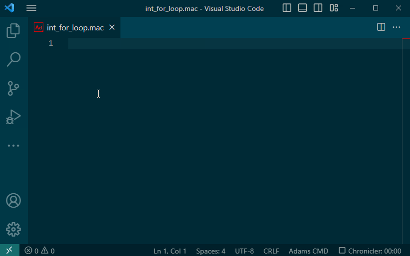

# Changelog

## 0.3.0 (September 1st 2023)
### Syntax Highlighting
- Added: Syntax highlighting for aview.log files
- Added: Syntax highlighting for .msg files

### Snippets
- Added: Integer For Loop
  
  

- Added: Request
  
  

### Improvements to the Adams View Python stub files
Improved type hints and doc strings.

### Improvements to Debugger
Added a **msc-adams.debugOptions** setting allowing options to be passed to the debugger when
attaching to Adams View. Example:
```json
    "msc-adams.debugOptions": {
    
        "justMyCode": false,
        "subProcess": true,
        "logToFile": true
    },
```
