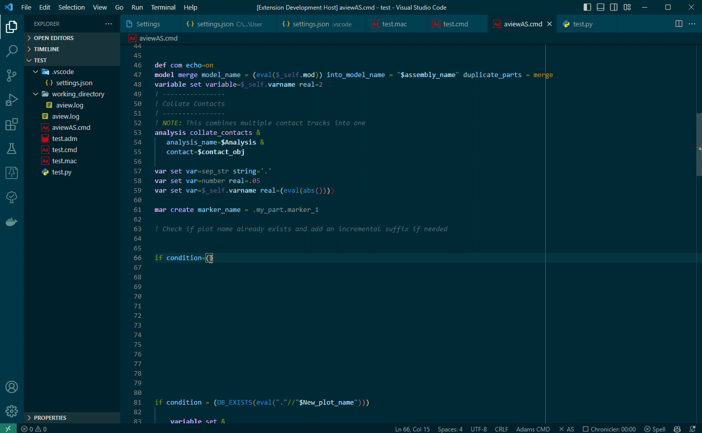
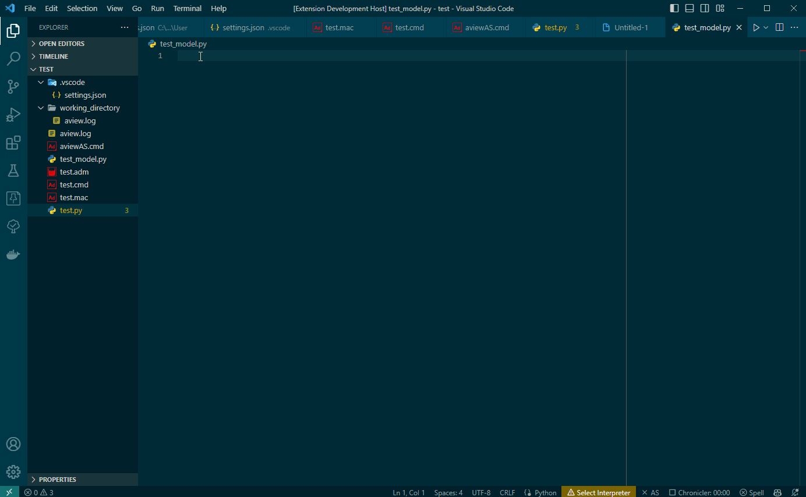
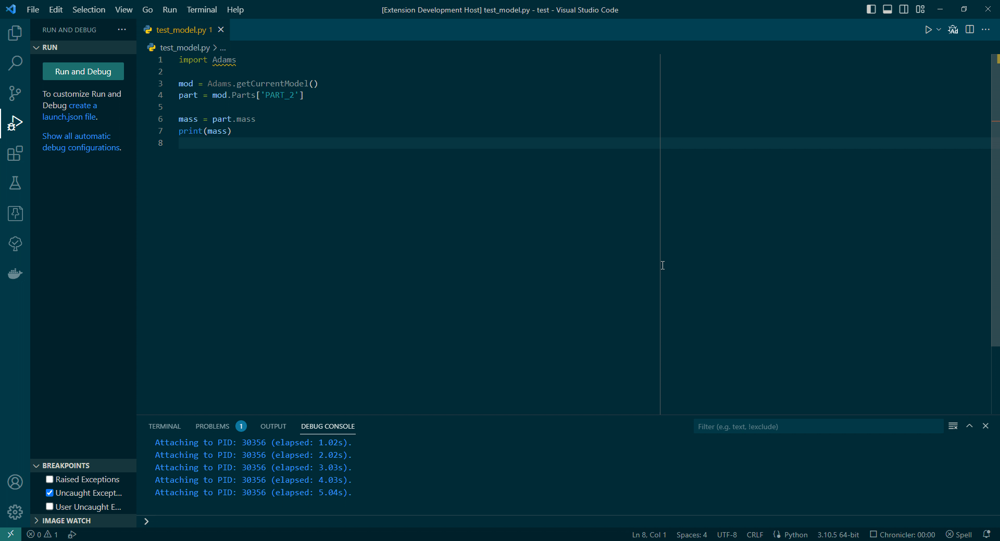
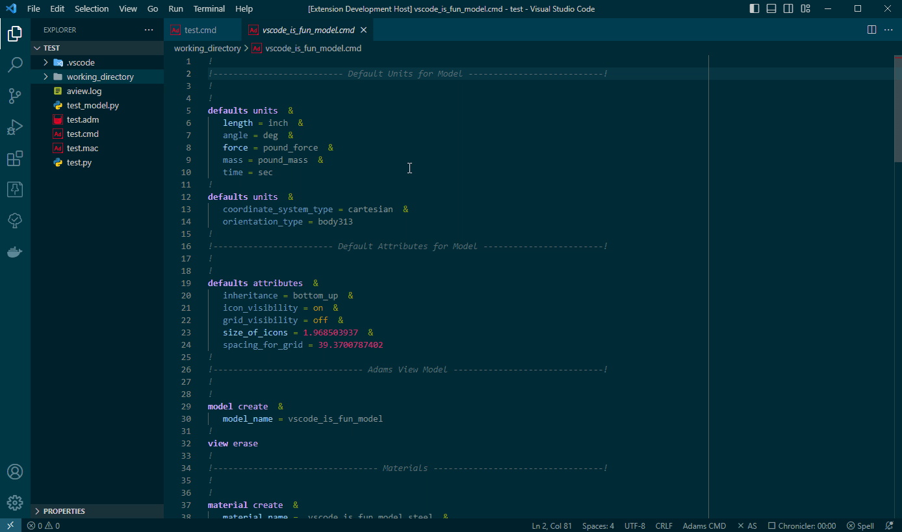
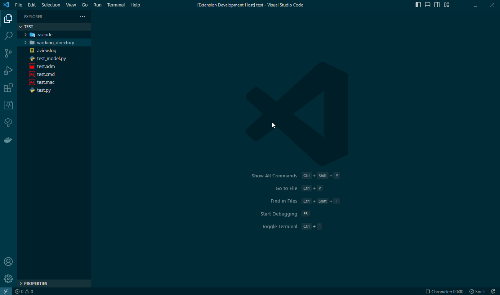
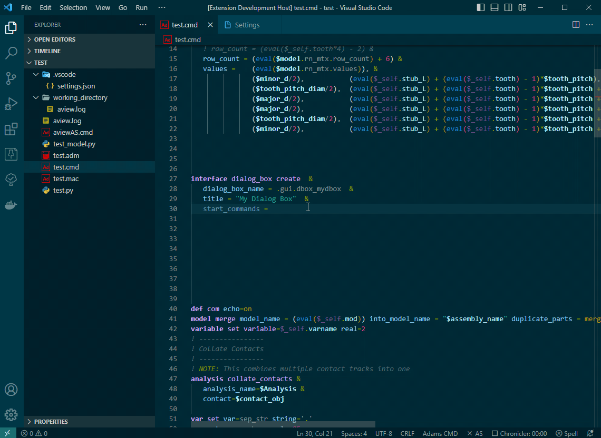

# MSC Adams Extension for Visual Studio Code

> This is an early version. If you are interested in using it, please [reach out](mailto:ben.thornton@hexgagon.com) and let me 
know which features you are most interested in. Thanks!

## Syntax highlighting
- Adams View Command Languange (.cmd)
- Adams Solver Dataset Files (.adm)
- Adams Solver Command Files (.acf)

## Adams View Command Language Intellisense
- Adams Function Completion Provider
- Adams Function Documentation Hover Provider




## Intellisense support for Adams View Python Interface
* Completion provider
* Function signature help provider
* Type hinting
> Note: You may need to manually activate the extension using `msc_adams.activate` for these features to work


## Support for debugging python scripts in Adams View
You can debug python scripts in Adams View using the [Python Extension](https://marketplace.visualstudio.com/items?itemName=ms-python.python). This extension provides a convenient button to attach the debugger to an existing Adams View process. 

### Steps to debug a python script in Adams View
1. Open an Adams View session
2. Open the python script you want to debug in Visual Studio Code
3. Click the **Debug Python Script in Adams** button in the top right of the editor
   - Note: If you have multiple Adams View sessions open, you will be prompted to select one
4. Set breakpoints in the python script
5. In the Adams View session, import the python script
6. The python script will break at the breakpoints.




## Open Adams View From Explorer
* Open Adams View in a directory from the Explorer by right clicking and selecting **Open View**
  

* Open a .cmd model file in Adams View from the Explorer by right clicking and selecting **Open In View**
  

## Snippets
- Adams View Command Language Snippets
- Adams View Python Interface Snippets
- 
## Extension Settings

This extension contributes the following settings:
  * msc-adams.adams_launch_command: Path to the mdi.bat file in your Adams installation.

### Customizing Syntax Colors

You may override the extension's default syntax colors using the `editor.tokenColorCustomizations` setting. The extension uses the following scopes:
 * parameter.reference
 * variable
 * constant
 * arguments
 * parameter.definition
 * selfParameter
 * command.command
 * command.control
 * command.argument
 * command.argument.continued

The example below would change the color and font style of the `variable` scope

```json
"editor.tokenColorCustomizations": {     
  "textMateRules": [
    {
      "scope": "variable",
      "settings": {
          "foreground": "#02485e",
          "fontStyle": "bold"
      }
    }
  ]
}
```
## Requirements

- [MSC Adams](https://hexagon.com/products/product-groups/computer-aided-engineering-software/adams)

## Known Issues

### Attaching the Debugger to Adams View does not work in version 2023
This is likely due to a change in the compilers for Adams 2023. I am working on a fix.

### Intellisense Adams Command Language *functions* does not work for every function
It's a work in progress. The help documentation for each function needs to be converted to a 
markdown file and I simply haven't had time to do every function.

### Equal Sign In A String On A Continuation Line
An equal sign in a string on a continuation line (i.e. a line following `&`) breaks syntax 
highlighting for the rest of the file.

> A workaround is to add `!"` after the line with the equal sign. As shown below.




## Contributing
...


## Support
Submit issues to https://github.com/bthornton191/adams_vscode/issues
