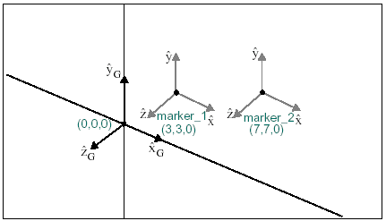

# ASIN

Returns the arc sine of an expression that represents a numerical value. ASIN is defined only when the absolute value of the expression is 1. The range of ASIN is [/2,/2] (that is,/2 < ASIN(x) < /2). 

## Format
```java
ASIN(x) 
```
## Argument

 


**x**  
: Any valid expression that evaluates to a real number.  


## Example

The following function calculates the value of the expression DX(marker_2, marker_1, marker_2) / DM(marker_2, marker_1). It then applies the ASIN function to the result and returns its arc sine. The location of marker_1 and marker_2 is shown in the figure below.

 


### Function  
```java
ASIN(DY(marker_2, marker_1, marker_2) / DM(marker_2, marker_1))  
```

### Returns  
```java
45  
```
