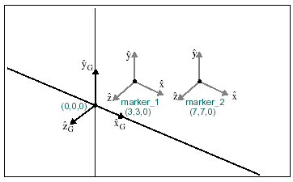

# ATAN

Returns the arc tangent of an expression that represents a numerical value. The range of `ATAN` is `[-pi/2, pi/2]` (that is, `pi/2 < ATAN(x) < pi/2`). 

## Format 
```java
ATAN(x)
```
## Argument

 


**x**  
: Any valid expression that evaluates to a real number. 


## Example 

The following example illustrates the use of the ATAN function. The location of marker_1 and marker_2 is shown in the figure below.

 


## Function  
```java
ATAN(DX(marker_2, marker_1, marker_2) /
DY(marker_2, marker_1, marker_2))  
```

## Returns  
```java
45  
```
