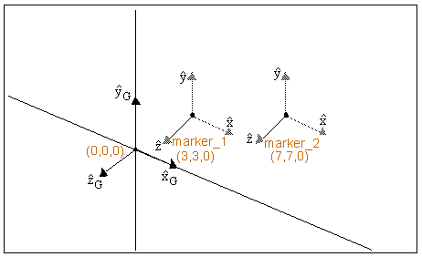

# COS

Returns the cosine of an expression that represents a numerical value. 

## Format 
```adams_cmd
COS(x) 
```
## Argument

 


**x**

Any valid expression that evaluates to a real number.  


## Example 

The following example illustrates the use of the `COS` function. The location of **marker_1** and **marker_2** is shown in the figure below.

 


### Function  
```adams_cmd
COS(DX(marker_2, marker_1, marker_2))  
```

### Result  
```adams_cmd
.99  
```


