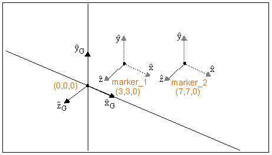

# COSH

Returns the hyperbolic cosine of an expression that represents a numerical value. 

## Format
```java
COSH(x) 
```
## Argument 

 


**x**
: Any valid expression that evaluates to a real number.  


## Example 

The following function returns the hyperbolic cosine of the z component of the displacement of marker_2 with respect to marker_1. The result is computed in the coordinate system of marker_1. The location of marker_1 and marker_2 is shown in the figure below.

 


### Function  
```java
COSH(DZ(marker_2, marker_1, marker_1))  
```

### Result  
```java
1  
```
